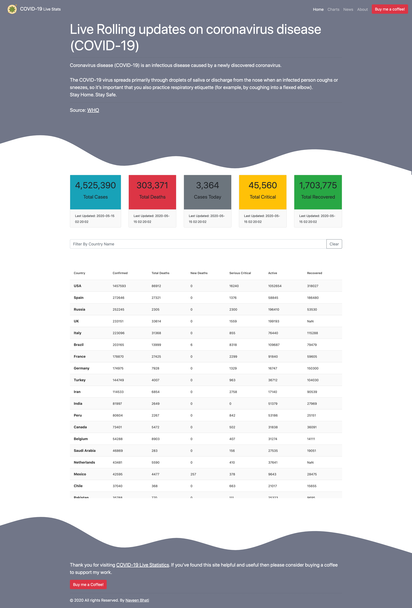
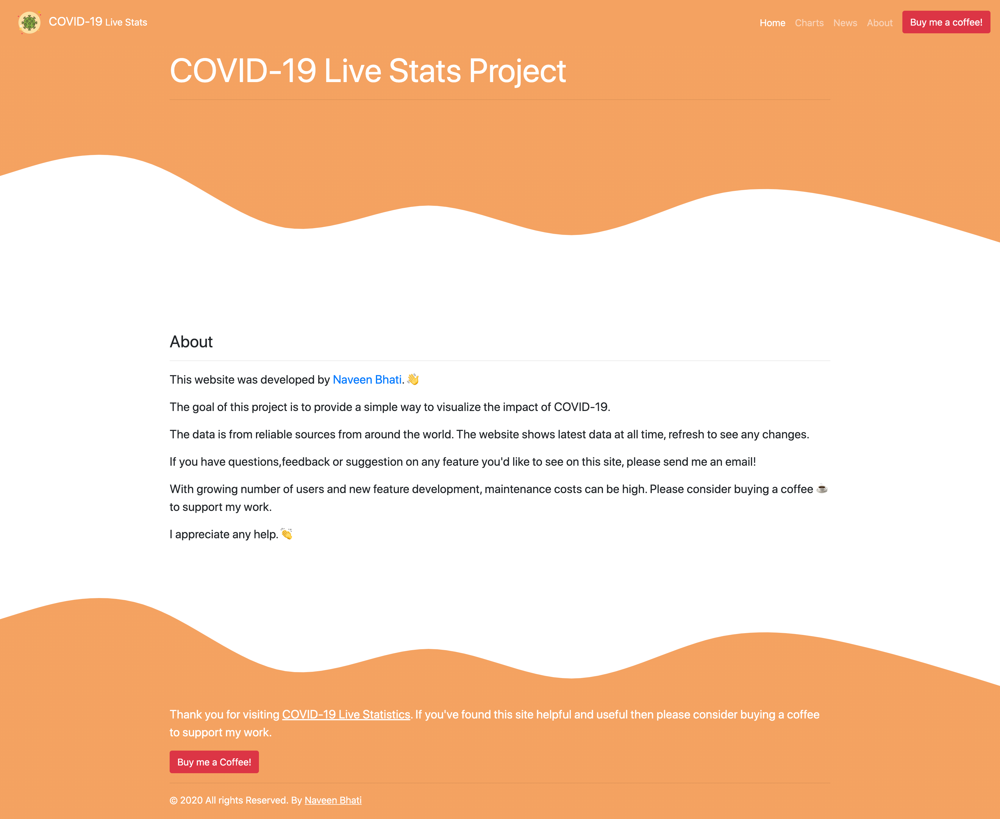
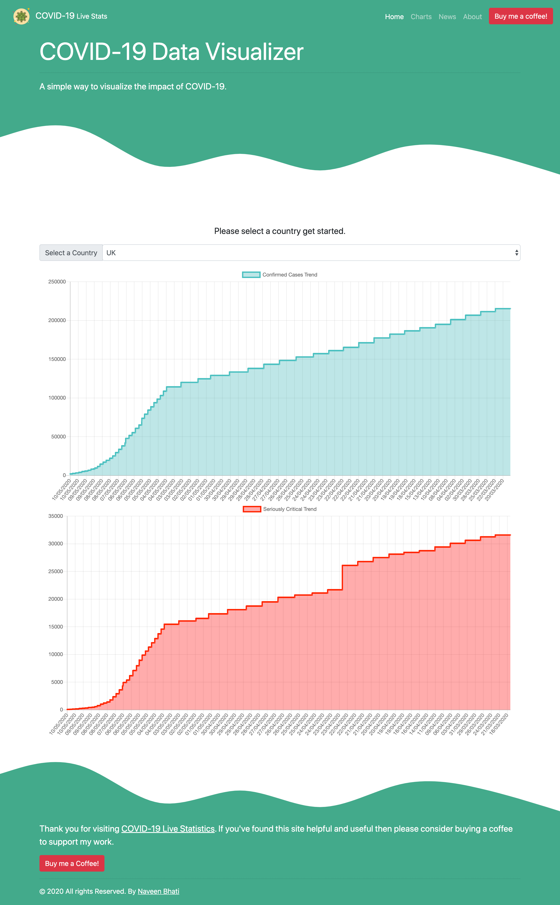
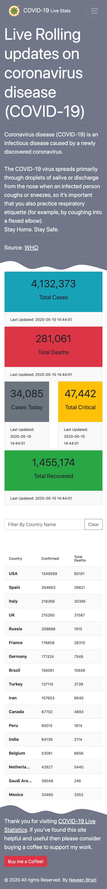

# Live Covid-19 Stats React App

## Useful Resources

[How to configure CSS and CSS modules in webpack](https://blog.jakoblind.no/css-modules-webpack/)

[How to setup Webpack and Babel for React](https://dev.to/iamismile/how-to-setup-webpack-and-babel-for-react-59ph)

[Async functions are always transformed to regenerator runtime](https://github.com/parcel-bundler/parcel/issues/871)

[Webpack Asset Management](https://webpack.js.org/guides/asset-management/)

[Tutorial: How to set up React, webpack, and Babel from scratch (2020)](https://www.valentinog.com/blog/babel/)

### Colors Used

- News Header - #e9c46a
- Chart Header - #43aa8b
- About header - #f4a261
- Home Header - #717688

## Website Screenshots

